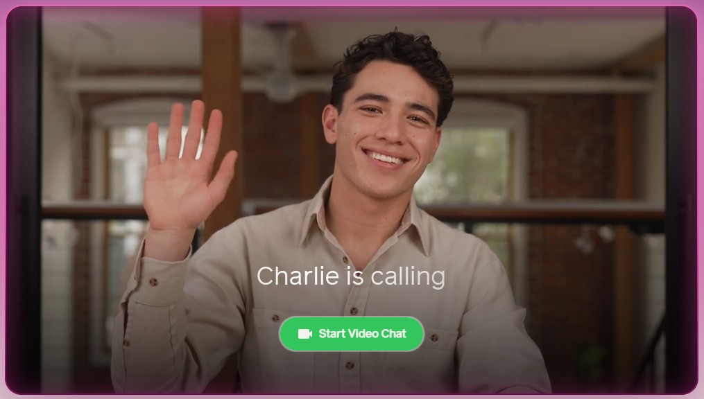
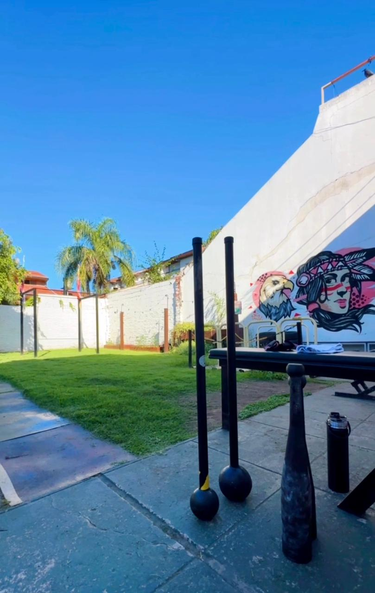
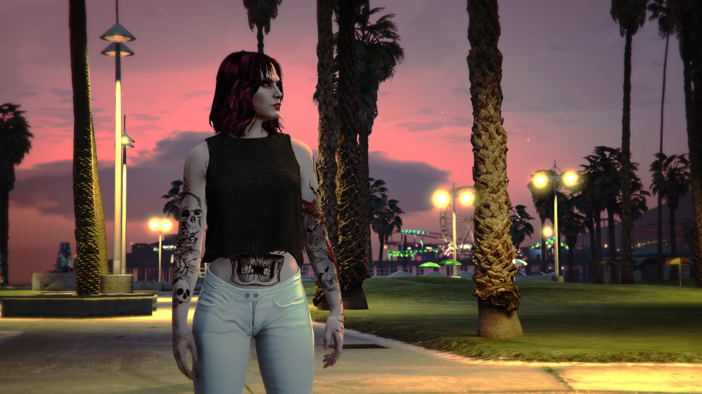

## Presentación - Gisela Degiglio

#### Bienvenidos a mi repo! Les cuento un poco sobre mi 🙂

---
Mi nombre es Gisela, hace 3 años trabajo para una empresa estadounidense creando, juntos a mis compañeros, simulaciones de conversaciones reales con avatars mediante inteligencia artificial. Me encargo principalmente de base de datos, creando toda la estructura que las llamadas necesitan para poder funcionar, asi como tambien a veces estoy como desarrolladora frontend, modificando o subiendo cosas que ayuden a mejorar el UI. 

Les presento a Charlie, uno de los avatar que estamos usando ultimamente para esas conversaciones. ❤️

---

### Hobbies

- Mi principal hobbie es entrenar, paso gran parte de mis dias en el gym, hago boxeo 🥊 y un entrenamiento particular del gimnasio donde voy, llamado Primitive Training - Macebells & Clubbells. 🏋️‍♀️

- Mi segundo hobbie favorito son los videojuegos, el poco tiempo libre que tengo me gusta pasarlo jugando, sola o con amigos cuando pueden tambien. Mayormente estoy en GTA Online, les comparto una foto de mi personaje 🥰

---

### Otros

- Me gusta mirar series/pelis de generos policiales o thrillers psicologicos mas que nada. 
- Gran fan de la Formula 1 🏎️❤️
- Escucho musica practicamente todo el dia, casi siempre en inglés.
